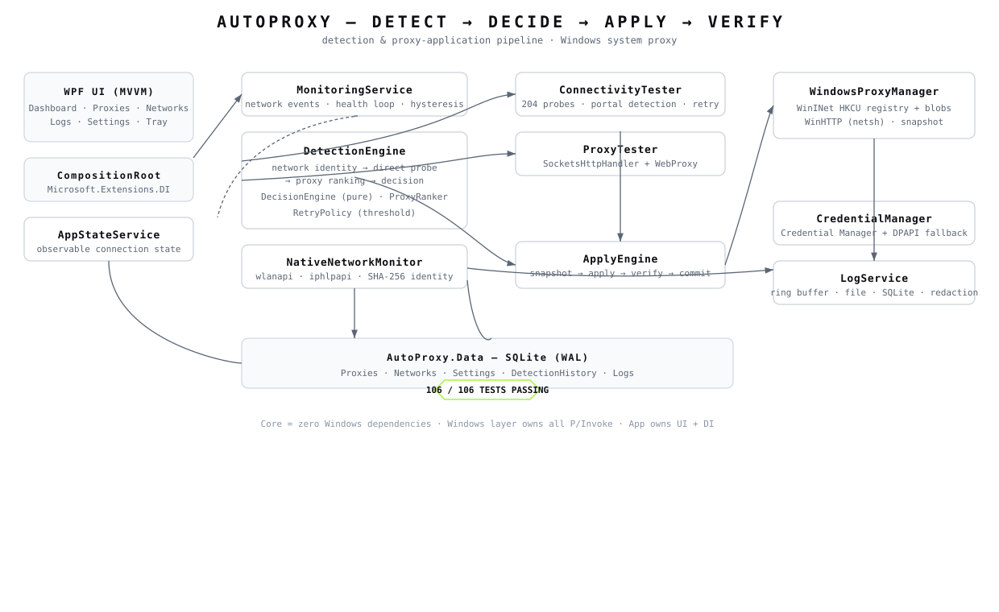

# AutoProxy

[](https://github.com/shoaryapatelop-lab/auto_proxy/actions/workflows/dotnet.yml)
[](https://dotnet.microsoft.com/download/dotnet/8.0)
[](https://github.com/shoaryapatelop-lab/auto_proxy/actions/workflows/dotnet.yml)
[](LICENSE)

**Automatically choose the right connection mode for whatever network you are on.**

AutoProxy is a Windows desktop application (`.NET 8` / WPF / C# 12) that watches
your network, tests real internet connectivity, and then switches the Windows
system proxy between **direct** and a configured **proxy server** — automatically.
It runs in the system tray, remembers what worked on each network, and restores
your previous settings when the app exits (or recovers after a crash).

```
┌──────────────────────────────────────────────────────────────────────────┐
│  You connect to a network (new office WiFi, VPN, coffee shop, LAN…)      │
│                                                                          │
│  1. AutoProxy detects the network change                                  │
│  2. Tests DIRECT connectivity against probe endpoints                     │
│  3. Works?               → DIRECT mode (no proxy)                         │
│  4. Blocked / portal?    → tests saved proxies, best one wins             │
│  5. Applies to Windows   → WinINet + WinHTTP, verified, then committed    │
│  6. Health-check loop    → on repeated failure, re-detect and switch      │
└──────────────────────────────────────────────────────────────────────────┘
```

> **Note:** this project manages your real Windows system proxy settings
> (HKCU `Internet Settings` + WinHTTP). Review the
> [Windows integration](#windows-integration) section before running it.

---

## Features

- **Automatic detection** — reacts to network changes (WiFi SSID / Ethernet
  interface / gateway + subnet) with a stable per-network identity.
- **Direct-connectivity probing** — tests public 204 endpoints
  (`connectivitycheck.gstatic.com`, `cp.cloudflare.com`, or your own) with
  captive-portal detection (redirects, login keywords, HTTP 511).
- **Smart proxy ranking** — when direct fails, candidates are scored
  deterministically (preferred network proxy, recency, success rate, latency),
  so the best proxy is tried first.
- **Verified apply with rollback** — snapshot → apply → read-back verify →
  (proxy only) traffic verify → commit. Any failure restores the previous
  Windows proxy configuration.
- **Per-network memory** — each network's preferred mode and preferred proxy
  are persisted; upcoming networks just work.
- **Manual modes** — `ManualDirect`, `ManualProxy`, `ManualDisable`, plus a
  `--no-monitor` launch flag to open the UI without touching the system proxy.
- **Health-check loop** — hysteresis (`RetryPolicy`) prevents flapping; a proxy
  failure has to repeat N times (`FailureThreshold`, default 3) before a full
  re-detection is triggered.
- **Safe Windows integration** — manages both WinINet and WinHTTP, broadcasts
  `WM_SETTINGCHANGE`, persists a proxy snapshot for crash recovery, and
  restores previous settings on exit.
- **Secure credentials** — proxy passwords go to the Windows Credential Manager
  with a DPAPI-protected local fallback; secrets never appear in logs.
- **Full app experience** — dark-themed WPF dashboard, system-tray menu, live
  log viewer, and a local SQLite database for proxies, networks, detection
  history and logs.
- **Tested** — 106 xUnit tests (unit + integration) covering detection,
  decision, apply, ranking, connectivity, repositories, credentialing and the
  Windows proxy registry round-trip.

---

## Requirements

| Requirement | Detail |
|---|---|
| OS | Windows 10 / Windows 11 (x64) |
| .NET SDK | **8.0.x** to build (`dotnet --version`) |
| .NET Runtime | Included — Release builds are published self-contained |
| Internet | A 204 probe endpoint reachable for connectivity tests |

---

## Getting started

### 1. Clone

```bash
git clone https://github.com/shoaryapatelop-lab/auto_proxy.git
cd auto_proxy
```

### 2. Restore, build, test

```bash
dotnet restore AutoProxy.sln
dotnet build  AutoProxy.sln --configuration Debug
dotnet test   AutoProxy.sln --configuration Debug
```

Expected outcome: **106 tests, all passing, 0 build warnings.**

### 3. Run

```bash
# Normal operation (monitoring enabled — will manage the system proxy)
dotnet run --project src/AutoProxy.App/AutoProxy.App.csproj

# Safe start: open the UI WITHOUT touching the system proxy
dotnet run --project src/AutoProxy.App/AutoProxy.App.csproj -- --no-monitor
```

The app starts as a **system-tray** application. First run asks nothing —
settings, proxies and history are created in `%LocalAppData%\AutoProxy\`.

---

## Install (publish a release)

Produce a single-file, self-contained Windows executable:

```bash
dotnet publish src/AutoProxy.App/AutoProxy.App.csproj `
  -c Release `
  -r win-x64 `
  --self-contained true `
  -p:PublishSingleFile=true `
  -o "%LocalAppData%\Programs\AutoProxy"
```

Per-user install (no admin rights needed):

- Copy/move the published folder wherever you like, or install to
  `%LocalAppData%\Programs\AutoProxy`.
- Create a shortcut to `AutoProxy.exe` in
  `%AppData%\Microsoft\Windows\Start Menu\Programs\`.

---

## Usage

The main window has five pages reachable from the sidebar:

| Page | What it does |
|---|---|
| **Dashboard** | Live status: current network, connection state, latency, mode, quick actions |
| **Proxies** | Add / edit / delete proxy profiles, toggle enabled, test now, set network-preferred, view stats & latency |
| **Networks** | Remembered networks, set per-network preferred mode (Detecting / Direct / Proxy), forget |
| **Logs** | Live log stream (color-coded by level) plus full history from SQLite |
| **Settings** | Probe URLs, timeouts, health-check cadence, failure threshold, apply/verify toggles, proxy restore |

Proxy profiles support optional authentication; credentials are stored in the
Windows Credential Manager (DPAPI fallback for oversized secrets).

### Modes

| Mode | Behaviour |
|---|---|
| `Automatic` | Detect networks and apply Direct/Proxy automatically (default) |
| `ManualDirect` | Force system proxy **off** |
| `ManualProxy` | Force the chosen proxy **on** |
| `ManualDisable` | Stop affecting the system proxy until reselected |

---

## How it works



### Detection pipeline

```
INetworkMonitor (NativeNetworkMonitor)
  └─ network identity: SHA-256(interface kind + SSID / gateway+subnet)

DetectionEngine
  ├─ current network resolved?  (no active interface  → Offline)
  ├─ direct connectivity test   (ConnectivityTester, per-endpoint classification)
  ├─ direct OK                  → Decision: Direct
  ├─ captive portal detected    → Decision: CaptivePortal (don't touch proxy)
  └─ direct failed              → ProxyRanker orders candidates → test in order
        └─ Decision: best working proxy, or Offline if all fail

DecisionEngine (pure function)
  Direct | Proxy | CaptivePortal | Offline | Error   (+ human-readable reason)
```

Connectivity probe classification distinguishes healthy responses, login-page /
redirected-to-login portals, content mismatch (blocked), HTTP errors, timeouts,
DNS failures, TLS errors and connection failures. Transient failures are retried
once (`250 ms`); HTTP `511` and login keywords (`log in`, etc.) mark a captive
portal.

### Apply pipeline (safety first)

```
Desired state  →  save snapshot  →  apply  →  300 ms settle
              →  read-back verify  →  (proxy only) traffic verify  →  commit
              →  ANY failure  →  RestorePreviousSettings (rollback)
```

Direct/Offline/CaptivePortal applies are read-back verified only (no traffic
check) to avoid flapping. `VerifyProxyAfterApply` (default `true`) gates the
proxy traffic check.

### Windows integration

- **WinINet** — HKCU `Software\Microsoft\Windows\CurrentVersion\Internet
  Settings` (`ProxyEnable`, `ProxyServer`, `ProxyOverride`), the binary
  `DefaultConnectionSettings` / `SavedLegacySettings` blobs, and an
  `InternetSetOption` + `WM_SETTINGCHANGE` broadcast so browsers (Edge, Chrome,
  Firefox in system mode) and WinINet apps pick it up.
- **WinHTTP** — `netsh winhttp set/reset proxy` for WinHTTP-based services and
  CLI tools.
- **Snapshot & crash recovery** — the previous configuration is persisted to
  `%LocalAppData%\AutoProxy\proxy_snapshot.json`; on startup the app detects a
  leftover applied state and restores it. On exit it always restores.
- **Ownership safety** — the `AutoConfigURL` (PAC/WPAD) value is never
  overwritten once a connection is detected.
- **Validation** — host/port are validated before touching the registry,
  blocking argument-injection style attacks.

---

## Project structure

```
AutoProxy.sln
├─ src/
│  ├─ AutoProxy.Core/        platform-independent business logic (no OS deps)
│  │  ├─ Models/             ProxyProfile, NetworkIdentity, AppSettings, …
│  │  ├─ Abstractions/       IProxyRepository, IConnectivityTester, …
│  │  ├─ Network/            ProxyValidator, ProxyTester, ConnectivityTester
│  │  ├─ Detection/          DetectionEngine, DecisionEngine, ProxyRanker, RetryPolicy
│  │  ├─ Apply/              ApplyEngine (verify + rollback)
│  │  ├─ Monitoring/         MonitoringService (background loop)
│  │  └─ Services/           AppStateService, LogService (redaction)
│  ├─ AutoProxy.Data/        SQLite persistence (5 tables, WAL), repositories
│  ├─ AutoProxy.Windows/     WindowsProxyManager, CredentialManager, NativeNetworkMonitor
│  └─ AutoProxy.App/         WPF app: CompositionRoot (DI), ViewModels, Views, TrayService
└─ tests/
   ├─ AutoProxy.Core.Tests/  100 tests (unit + integration)
   └─ AutoProxy.Windows.Tests 6 tests (Credential Manager + registry round-trip)
```

Data is stored in a SQLite database at:

```
%LocalAppData%\AutoProxy\
├─ autoproxy.db             (SQLite, WAL mode — proxies, networks, settings,
│                             detection history, logs)
├─ proxy_snapshot.json      (crash-recovery snapshot of the previous proxy config)
└─ credentials.dpapi        (DPAPI-protected fallback credential store)
```

---

## Configuration

Runtime settings persist in the `Settings` table and are editable in the
**Settings** page. Defaults:

| Setting | Default | Meaning |
|---|---|---|
| `ProbeUrls` | gstatic + Cloudflare `generate_204` | Endpoints probed for direct connectivity |
| `CustomProbeUrl` | *(empty)* | Extra probe URL |
| `DirectTestTimeoutMs` | `8000` | Timeout per direct probe |
| `ProxyTestTimeoutMs` | `8000` | Timeout per proxy test |
| `HealthCheckIntervalSeconds` | `60` | Background health-check cadence |
| `FailureThreshold` | `3` | Consecutive failures before re-detection |
| `CooldownSeconds` | `30` | Cooldown between re-detections |
| `VerifyProxyAfterApply` | `true` | Traffic-verify a proxy after applying it |
| `StartMonitoringOnLaunch` | `true` | Auto-detect at startup |
| `CloseToTray` | `true` | Closing the window minimizes to tray |

---

## Testing

```bash
dotnet test AutoProxy.sln                          # everything
dotnet test tests/AutoProxy.Core.Tests              # core only
dotnet test tests/AutoProxy.Windows.Tests           # windows only
dotnet test --filter FullyQualifiedName~DecisionEngineTests   # one class
```

**106 tests / 14 classes / all green**

| Area | Coverage |
|---|---|
| `ProxyValidatorTests` | Host/port validation, address formatting (incl. IPv6) |
| `AppSettingsTests` | Probe-URL dedup, settings factories |
| `DecisionEngineTests` | Every decision branch + reason strings |
| `ConnectivityTesterTests` | Classification, retries, captive portals, timeouts |
| `ProxyRankerTests` | Deterministic ordering, preferred, ties |
| `ApplyEngineTests` | No-op, apply, read-back, verify, rollback paths |
| `MonitoringServiceTests` | Superseding, applies, apply-failure, manual modes |
| `DetectionEngineIntegrationTests` | End-to-end detection against fakes |
| `RetryPolicyTests` | Hysteresis threshold, escalation, reset |
| `RepositoryTests` | SQLite CRUD round-trips for all repositories |
| `LogServiceTests` | Credential redaction |
| `CredentialManagerTests` | Round-trip, DPAPI fallback, edge cases |
| `WindowsProxyManagerTests` | Registry enable/disable/restore round-trips |

A generated HTML test report is kept in [`reports/`](reports/).

---

## Security

- Credentials are stored via the **Windows Credential Manager**; if that rejects
  a secret (size limits etc.) it falls back to a **DPAPI-protected** local file.
  Nothing is stored in plaintext.
- The **log service redacts** `user:pass@host` patterns in messages and details.
- The direct-connectivity HTTP client **bypasses the system proxy** so “direct”
  results are honest even when a proxy is currently configured.
- Proxy host/port are validated before any registry or `netsh` write.

---

## Troubleshooting

- **“System proxy did not take the expected value”** — the apply failed
  read-back verification and rolled back. Check anti-virus/policy software that
  locks `Internet Settings`; verify the proxy is reachable and not requiring
  auth if `VerifyProxyAfterApply` is on.
- **App reports `CaptivePortal`** — you are behind a login page; it won’t force
  a proxy. Log in and re-test.
- **“rollback FAILED”** — the previous proxy configuration could not be
  restored automatically; restore it manually in
  `Settings > Internet Options > Connections > LAN settings`.
- **Proxy not applied to one app** — some apps (sandboxed UWP, hard-coded
  proxies, SSH) ignore the Windows system proxy entirely.
- **Crash recovery** — if you restart and the proxy from the previous session is
  still active, AutoProxy restores it automatically on launch.

---

## Contributing

1. Fork the repository and branch off `main`.
2. Keep the layering discipline — **no Windows-specific code in
   `AutoProxy.Core`**, platform work goes in `AutoProxy.Windows`.
3. Add/update xUnit tests for any change and keep the full suite green
   (`dotnet test AutoProxy.sln`).
4. Open a pull request; CI builds and tests on `windows-latest`.

---

## License

[MIT](LICENSE) © 2026 Shoarya Patel.

---

## Development notes

- [`WORKFLOW.txt`](WORKFLOW.txt) — project workflows (setup, build, test,
  release) and the accumulated work log.
- [`PROJECT_REPORT.txt`](PROJECT_REPORT.txt) — full architecture report, file
  inventory and design decisions.